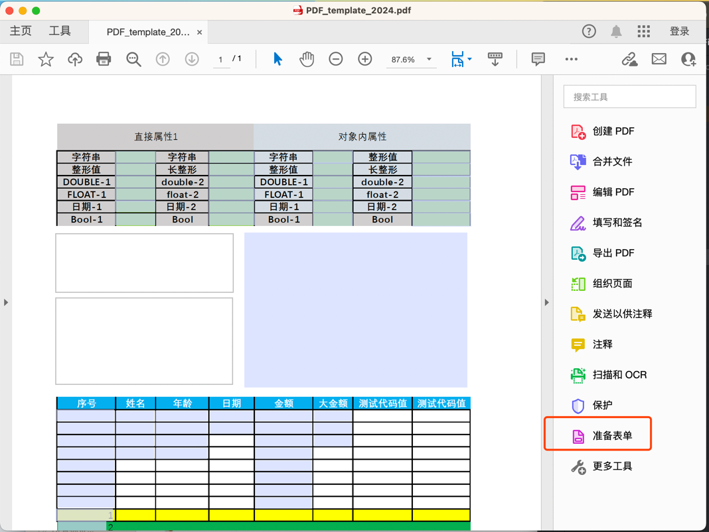
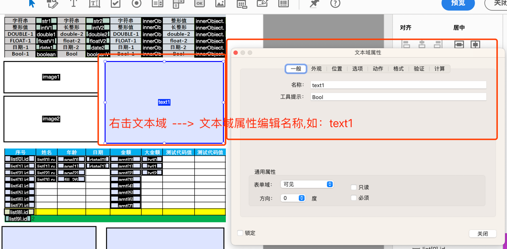
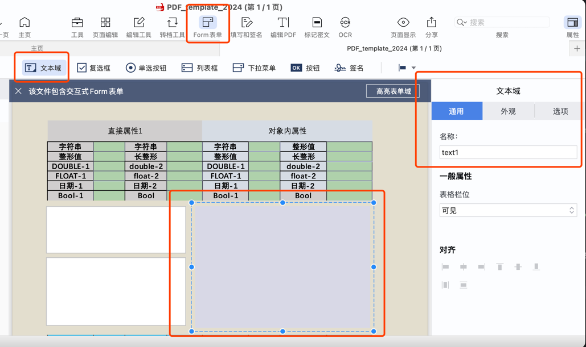
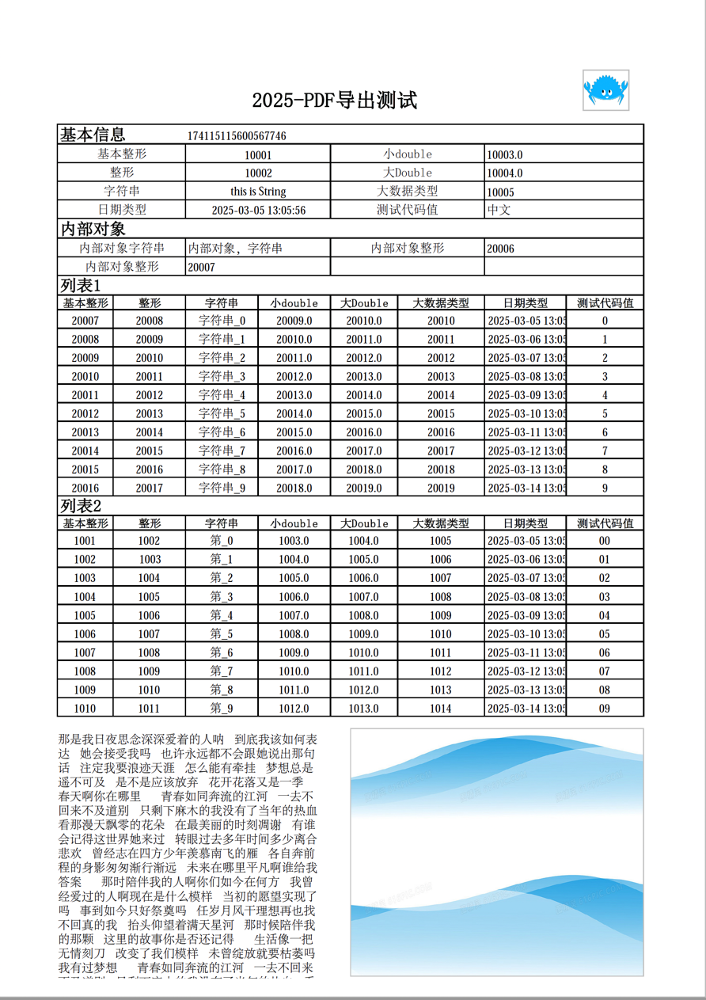
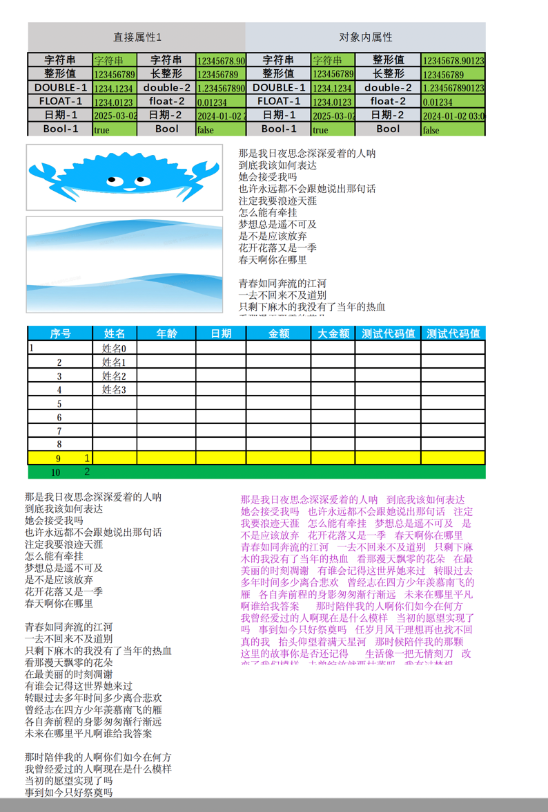
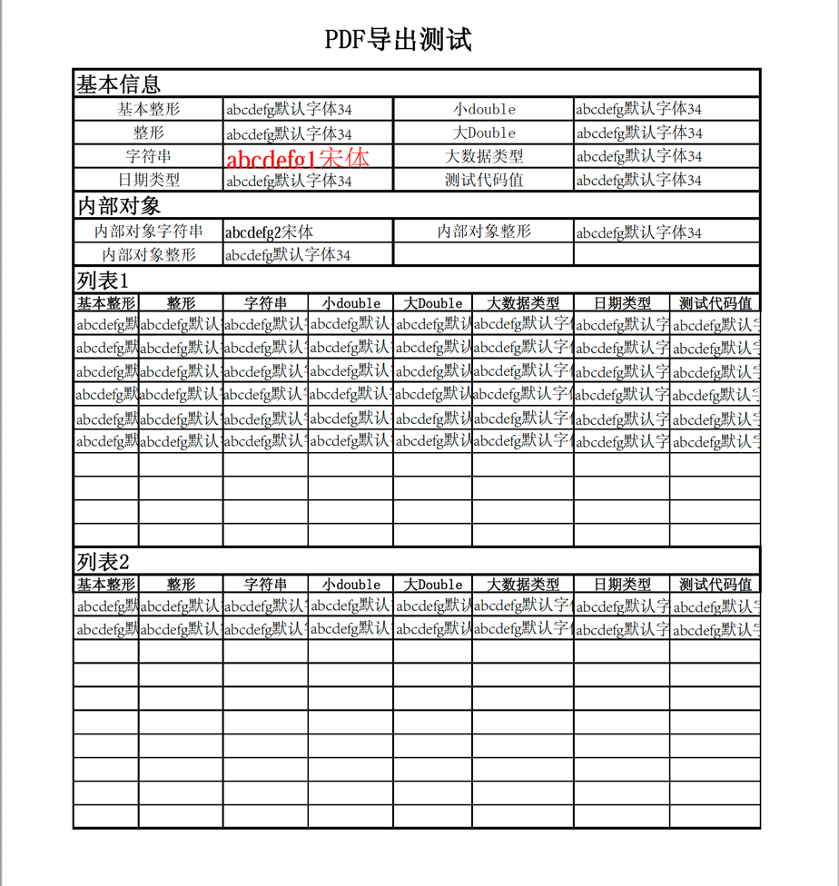

# nohi-doc

## 功能
* 文档类型
  * excel
  * pdf
* 程序技术模型
  * 配置
    * xml
    * annotation
    * 人工初始化
  * 运行
    * 输入
    * 输出
  * 测试

## 配置化
### TDD驱动
* excel 导入、导出测试类
[TestExcelExport.java](src%2Ftest%2Fjava%2Fnohi%2Fdoc%2Fservice%2Fexcel%2FTestExcelExport.java)
[TestExcelExportRepeat.java](src%2Ftest%2Fjava%2Fnohi%2Fdoc%2Fservice%2Fexcel%2FTestExcelExportRepeat.java)
[TestExcelImport.java](src%2Ftest%2Fjava%2Fnohi%2Fdoc%2Fservice%2Fexcel%2FTestExcelImport.java)
[TestXlsmExport.java](src%2Ftest%2Fjava%2Fnohi%2Fdoc%2Fservice%2Fexcel%2FTestXlsmExport.java)

* 配置
* `doc.properties` 指定各个配置文件名和相对路径
* `nohi-doc.xml`  文档主配置/根配置，配置了所有文档的基本信息、及具体配置文档路径

### 码值映射
* 配置: `codeType`
  ```xml
  <col column="6" property="test" codeType="CurrencyCd">测试代码值</col>
  ```
  * 导入时：根据excel值，查找对应的key
  * 导出时：根据对象的值，映射码值下对应的value,导出到excel中
* 映射服务
  映射服务：采用spi机制提供服务，并提供默认实现`DefaultCodeMappingService`
  该服务解析`docconf/nohi_encode_conf.xml`文件
* 自定义码值实现类：
  * 实现接口及接口对应方法
  ```java
  public class TestDefaultCodeMappingService implements ICodeMappingService {
  }
  ```
  * 注册spi
  ```
  1. resource下建立目录：META-INF/services/
  2. 创建文本文件(无后缀)： nohi.doc.service.ICodeMappingService
  3. 自定义类的包+类，写入文件[nohi.doc.service.ICodeMappingService]中
  ```

## PDF
### PDF表单
#### 制作PDF表单
* 通过Excel制作表单如： `test/template/pdf/pdf_template.xlsx`
* Excel 导出 PDF
  * 注意视图->分页预览，调整成一个完整的，否则导出的表单出现换页的情况
  * 本机使用mbp电脑，使用上面导出怎么调都换行。可以使用打印预览里的导出PDF
* 创建表单
> 可以使用Adobe Acrobat 或者 Pdf Reader Pro
  * 表单中每个域分配设置不同字段，准备表单
  * 文本域、图片域
  * `Adobe Acrobat`
  
     
     
  
  * `Pdf Reader Pro`
  
     
  
* Java代码
> `TestPDFExport.exportPdf2024 exportPdf2025`
```java
@Test
public void exportPdf2024() throws Exception {
  String fileName = "template/pdf/PDF_template_2024.pdf";
  String outPutFileName = "PDF_2024_out.pdf";
  // 1、创建一个PdfWriter对象，将文档写入到文件中
  PdfReader reader = new PdfReader(fileName);
  PdfWriter writer = new PdfWriter(outPutFileName);
  // 2、初始化一个PdfDocument对象
  PdfDocument pdf = new PdfDocument(reader, writer);
  PdfAcroForm form = PdfAcroForm.getAcroForm(pdf, true);
  // 创建字体
  PdfFont font = PdfFontFactory.createFont("STSong-Light", "UniGB-UCS2-H", PdfFontFactory.EmbeddingStrategy.PREFER_NOT_EMBEDDED);
  pdf.addFont(font);
  // 数据对象
  TestDocVO data = getData(10);

  /**
   *  循环表单字段
   *   // 根据表单域中字段，自动匹配数据对象中的字段，支持列表、map、嵌套对象
   *   // pdf域字段         数据对象[TestDocVO]字段
   *   // str1             str1
   *   // innerObject.str1 innerObject.str1
   *   // list[0].id       list
   */
  form.getAllFormFields().forEach((item, field) -> {
    field.setFont(font).setFontSize(10);

    Object value = Clazz.getValue(data, item, false);
    if (null != value) {
      if (value instanceof Date) {
        field.setValue(DateUtils.format((Date) value, DateUtils.HYPHEN_TIME));
      } else {
        field.setValue(value.toString());
      }
    }
  });
  String projectPath = FileUtils.getProjectPath();
  Path txt = Paths.get(projectPath, "src/test/java/nohi/doc/pdf/Text.txt");
  String text = FileUtils.readStringFromPath(txt);

  // 设置文本域
  form.getField("text1").setValue(text);

  // 长文本，自动换行，超过文本域高度的行，被自动隐藏
  // pdf的文本域需要设置成自动换行
  form.getField("text3").setValue(text.replaceAll("[\\r|\\n]", "    "));
  form.getField("text4").setValue(text);

  // 设置图片
  PdfButtonFormField imageField = (PdfButtonFormField) form.getField("image1");
  String imFile = "src/test/resources/assert/images/sirref.png";
  imageField.setImage(imFile);

  imageField = (PdfButtonFormField) form.getField("image2");
  imFile = "src/test/resources/assert/images/2.jpeg";
  imageField.setImage(imFile);

  form.flattenFields();
  pdf.close();
}
```
* 导出效果`pdf_template_20250225`

  
  
  
